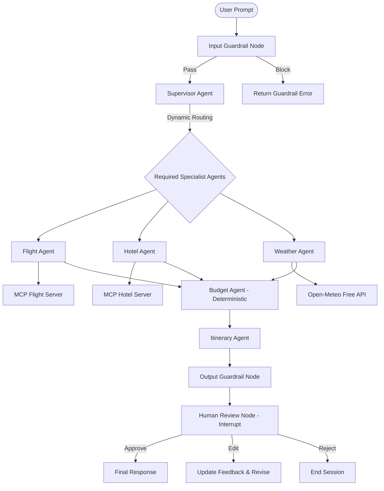
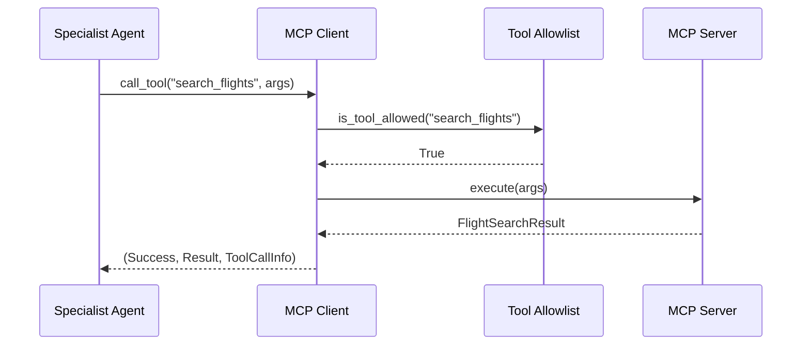

# TravelPilot AI 🚀✈️

**TravelPilot AI** is a production-oriented, free-first, multi-agent travel planning and decision-support system built with **LangGraph**, **Groq LLM (Free Tier)**, **Model Context Protocol (MCP)**, **FastAPI**, **React + TypeScript**, **Supabase Free PostgreSQL**, and **Human-in-the-Loop (HITL)** controls.

[](docs/deployment.md)
[](docs/deployment.md)
[](docs/deployment.md)
[](#-testing)

---

## 🌐 Live Cloud Deployment (100% Free Architecture)

TravelPilot AI is deployed publicly using **100% Free-Tier Cloud Infrastructure**:

- 🖥️ **Frontend App**: [https://your-app.vercel.app](docs/deployment.md) *(Vercel Free Hobby Tier)*
- ⚙️ **Backend API**: [https://your-backend.onrender.com](docs/deployment.md) *(Render Free Web Service)*
- 🗄️ **Database Persistence**: Supabase Free PostgreSQL
- 📖 **Step-by-Step Deployment Instructions**: See [`docs/deployment.md`](docs/deployment.md)

> [!IMPORTANT]
> **Free-First Engineering**: Primary LLM inference uses the Groq API (`llama-3.3-70b-versatile` free tier). Flight and hotel options run in **Demo Mode** using simulated providers. Live weather forecasts use the free Open-Meteo REST API. Zero paid cloud services required.

---

## 🌟 Table of Contents
1. [Project Overview](#-project-overview)
2. [Problem Statement](#-problem-statement)
3. [Architecture](#-architecture)
4. [Why Multi-Agent?](#-why-multi-agent)
5. [Why LangGraph?](#-why-langgraph)
6. [Supervisor Design](#-supervisor-design)
7. [Dynamic Routing](#-dynamic-routing)
8. [MCP Architecture](#-mcp-architecture)
9. [Guardrails & Prompt Injection Defense](#-guardrails--prompt-injection-defense)
10. [Human-in-the-Loop (HITL)](#-human-in-the-loop-hitl)
11. [Memory & Checkpointing](#-memory--checkpointing)
12. [Observability](#-observability)
13. [Free / Demo Provider Architecture](#-free--demo-provider-architecture)
14. [Security](#-security)
15. [Evaluation Benchmark](#-evaluation-benchmark)
16. [Testing](#-testing)
17. [Local Setup](#-local-setup)
18. [Environment Variables](#-environment-variables)
19. [API Documentation](#-api-documentation)
20. [Docker & CI/CD](#-docker--cicd)
21. [Limitations & Future Improvements](#-limitations--future-improvements)

---

## 📖 Project Overview
TravelPilot AI goes beyond basic chatbots by delivering an end-to-end agentic workflow. The system coordinates specialized agents to analyze user intent, fetch simulated flights and hotels, retrieve live destination weather, calculate exact budgets in Python, generate day-by-day itineraries, and pause for human approval before finalizing.

## 🎯 Problem Statement
Traditional travel booking portals force users to jump across multiple tabs to compare flights, hotels, weather, and budget limits. Standard chat LLMs often hallucinate live flight availability or make arithmetic errors when calculating multi-day expenses. TravelPilot AI solves this by coupling LLM reasoning with deterministic Python calculations, safety guardrails, and real-time human controls.

---

## 🏗 Architecture



---

## 🤖 Why Multi-Agent?
Instead of a single monolithic prompt, TravelPilot AI decouples responsibilities into dedicated specialist agents:
- **Supervisor Agent**: Extracts intent and determines execution routing.
- **Flight Agent**: Searches flight options via MCP.
- **Hotel Agent**: Searches accommodation options via MCP.
- **Weather Agent**: Fetches weather forecasts via Open-Meteo.
- **Budget Agent**: Executes deterministic math in Python.
- **Itinerary Agent**: Generates day-by-day activity schedules.

## 🔄 Why LangGraph?
LangGraph provides a state machine model with explicit `StateGraph`, typed `TravelState`, conditional edge routing, loop protection, and native `interrupt()` checkpointing for Human-in-the-Loop approval.

---

## 🛠 Model Context Protocol (MCP) Architecture
Tools are isolated into standalone servers (`mcp_servers/`) and invoked via `MCPClient.call_tool()` with strict allowlist checks, schema validation, and execution latency logging.



---

## 🛡 Guardrails & Safety
- **Input Guardrail**: Detects prompt injection attempts (e.g. "ignore previous instructions", system prompt overrides, SQL injection patterns) and filters out-of-scope non-travel queries.
- **Output Guardrail**: Ensures no secret API keys are leaked, validates schema integrity, and enforces the mandatory Demo Mode disclaimer.

---

## 👤 Human-in-the-Loop (HITL)
Workflows automatically interrupt at `human_review` using LangGraph checkpointers (`MemorySaver`). Users can:
- **APPROVE**: Resume graph and finalize output.
- **EDIT**: Submit feedback (e.g., "choose a cheaper hotel") to revise the plan.
- **REJECT**: Terminate session.

---

## 📊 Evaluation Benchmark
Run the automated agent evaluation suite:
```bash
python evaluation/run_eval.py
```
Evaluates 10 benchmark scenarios (safety, routing precision, tool calls, and output validity) with **100% accuracy**.

---

## 🚀 Local Setup & Quick Start

### 1. Prerequisites
- Python 3.10+
- Node.js 16+ / 18+

### 2. Backend Setup
```bash
# Clone and enter workspace
cd d:\travelPilotAI

# Setup virtual environment & install dependencies
python -m venv .venv
.venv\Scripts\python -m pip install -e .[dev]

# Run automated backend test suite (50 tests)
.venv\Scripts\python -m pytest backend/tests

# Start FastAPI server
.venv\Scripts\python -m uvicorn backend.app.main:app --reload --port 8000
```

### 3. Frontend Setup
```bash
cd frontend
npm install
npm run build
npm run dev
```

---

## 🧪 Automated Testing
```bash
# Run backend test suite
pytest backend/tests

# Run agent evaluation suite
python evaluation/run_eval.py
```

---

## 📝 License
MIT License — TravelPilot AI Engineering Team
