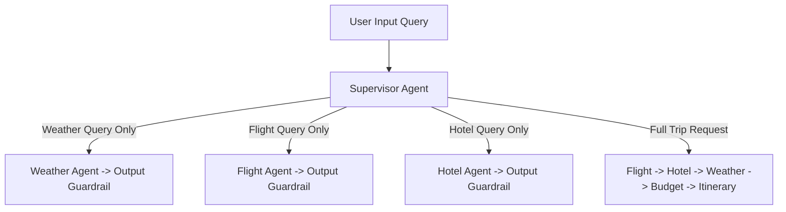

# Agent Design Specification & Supervisor Routing

## Supervisor Routing Diagram

## Agent Specification Table

| Agent | Responsibility | Primary Tool / Provider | Output Schema |
| :--- | :--- | :--- | :--- |
| **Supervisor** | Intent extraction & dynamic agent selection | Groq LLM / Rule-based | `SupervisorDecision` |
| **Flight Agent** | Flight option search & comparison | MCP `search_flights` | `FlightSearchResult` |
| **Hotel Agent** | Accommodation option search & rating check | MCP `search_hotels` | `HotelSearchResult` |
| **Weather Agent** | Destination weather forecast | Free Open-Meteo REST API | `WeatherResult` |
| **Budget Agent** | Deterministic cost calculation & balance | Python Math Engine | `BudgetAnalysis` |
| **Itinerary Agent** | Day-by-day activity synthesis & scheduling | Structured Reasoning | `Itinerary` |
