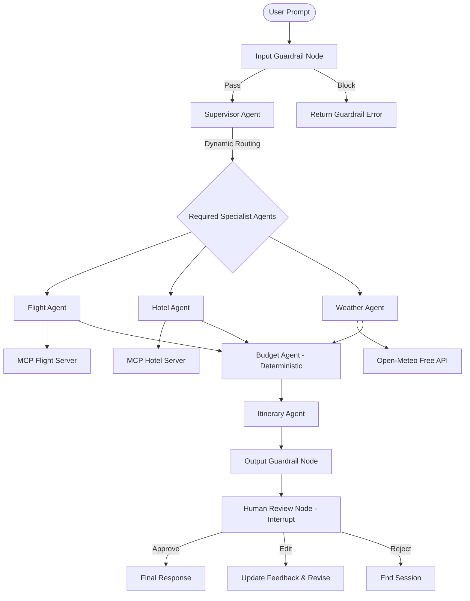
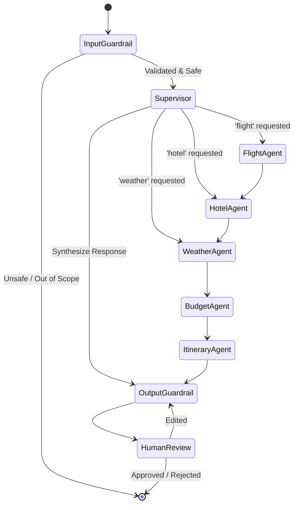

# TravelPilot AI — Architecture & System Design

## 1. High-Level Architecture

## 2. LangGraph Stateful Workflow

## 3. Why Multi-Agent & Why LangGraph?
* **Decoupled Responsibilities**: Small, focused specialist agents (Flight, Hotel, Weather, Budget, Itinerary) prevent giant prompt pollution and improve reasoning precision.
* **Deterministic Financial Control**: Arithmetic calculations (flight + hotel + daily expenses) are computed in pure Python within the `BudgetAgent`, eliminating LLM calculation hallucinations.
* **Stateful Interrupts**: LangGraph provides native checkpointer thread state (`MemorySaver` / SQLite) allowing the workflow to interrupt execution for human review and resume seamlessly when approved, edited, or rejected.
