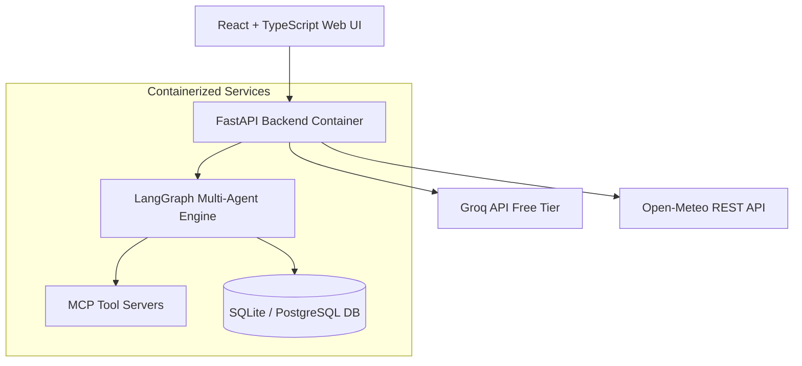

# Production Deployment Architecture

```mermaid
flowchart TD
    Client[React + TypeScript Web UI] --> API[FastAPI Backend Container]
    
    subgraph Containerized Services
        API --> Graph[LangGraph Multi-Agent Engine]
        Graph --> MCP[MCP Tool Servers]
        Graph --> SQLite[(SQLite / PostgreSQL DB)]
    end
    
    API --> Groq[Groq API Free Tier]
    API --> Weather[Open-Meteo REST API]
```
