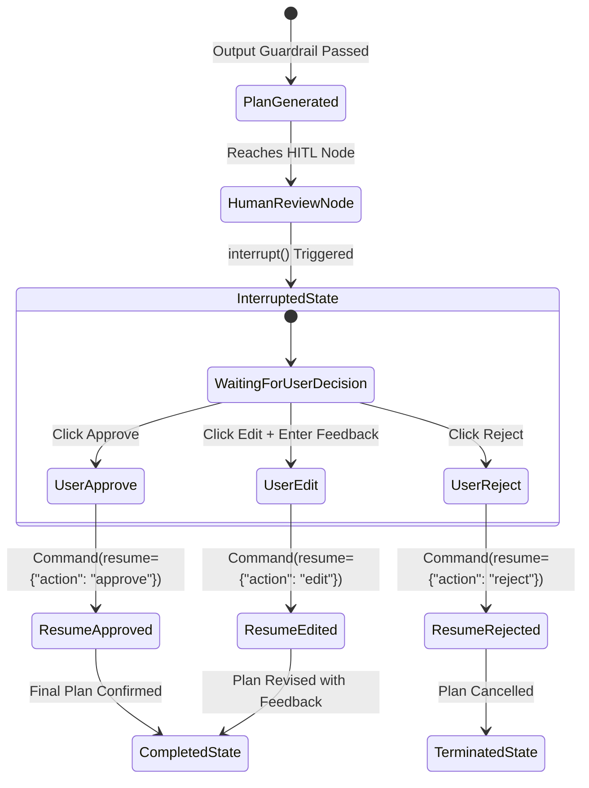

# Human-in-the-Loop (HITL) Specification

## HITL Workflow State Diagram

```mermaid
stateDiagram-v2
    [*] --> PlanGenerated: Output Guardrail Passed
    PlanGenerated --> HumanReviewNode: Reaches HITL Node
    HumanReviewNode --> InterruptedState: interrupt() Triggered
    
    state InterruptedState {
        [*] --> WaitingForUserDecision
        WaitingForUserDecision --> UserApprove: Click Approve
        WaitingForUserDecision --> UserEdit: Click Edit + Enter Feedback
        WaitingForUserDecision --> UserReject: Click Reject
    }
    
    UserApprove --> ResumeApproved: Command(resume={"action": "approve"})
    UserEdit --> ResumeEdited: Command(resume={"action": "edit"})
    UserReject --> ResumeRejected: Command(resume={"action": "reject"})
    
    ResumeApproved --> CompletedState: Final Plan Confirmed
    ResumeEdited --> CompletedState: Plan Revised with Feedback
    ResumeRejected --> TerminatedState: Plan Cancelled
```
