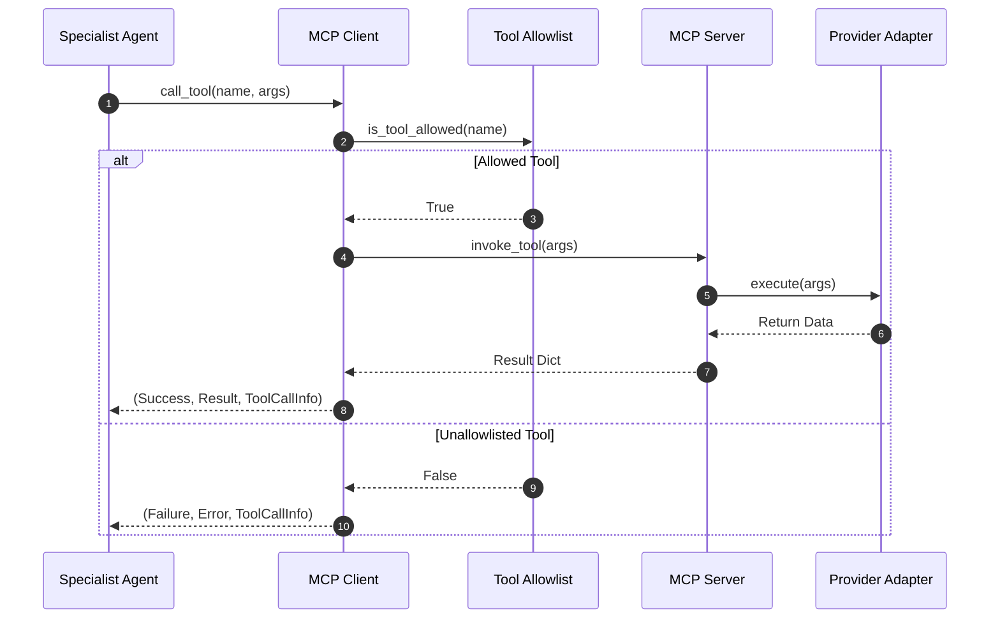

# Model Context Protocol (MCP) Design

## MCP Communication Diagram

## MCP Tools Catalog
1. `search_flights(origin, destination, travelers)`
2. `get_flight_details(flight_number)`
3. `search_hotels(destination, nights, travelers)`
4. `get_hotel_details(hotel_name)`
5. `get_weather_forecast(destination, days)`
6. `search_attractions(destination)`
7. `get_destination_info(destination)`
