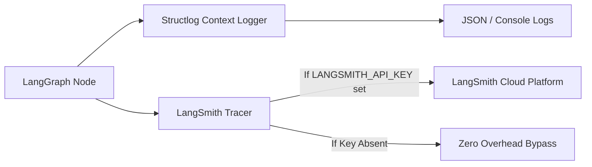

# Observability & Tracing Architecture

## Observability Data Flow

```mermaid
flowchart LR
    Node[LangGraph Node] --> Structlog[Structlog Context Logger]
    Structlog --> Console[JSON / Console Logs]
    
    Node --> Tracer[LangSmith Tracer]
    Tracer -->|If LANGSMITH_API_KEY set| LangSmithCloud[LangSmith Cloud Platform]
    Tracer -->|If Key Absent| NoOp[Zero Overhead Bypass]
```
